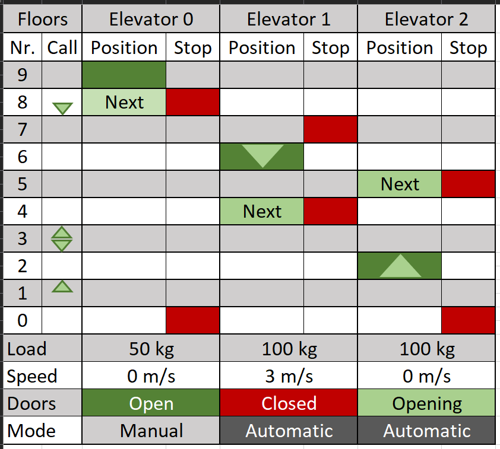

# Elevator Control Center (Team C)

## Running this project

To run this project, the JAR file can be downloaded from the
[Release](https://github.com/fhhagenberg-sqe-esd-ws21/elevator-control-center-team-c/releases) section of the
repository.
The downloaded file can be executed on any platform by issuing the following command.
The command assumes, that Java version >=11 is installed on your system and Java itself is in your systems path:

```
java -jar ecc-team-c-0.0.1-SNAPSHOT.jar
```

## The Project

The goal of this project is to create a GUI with JavaFX for an Elevator Controller Center (ECC).
Most important part of this project is nevertheless to ensure the software quality by using 
the techniques we learned in the SQE course.

## Requirements
The following requirements shall be met:
- [x] implement GUI
  - [x] display elevator position, direction, payload, speed, door state, target
  - [x] display call/stop request for each floor
  - [x] display a switch for automatic/manual mode
- [x] implement manual mode
  - [x] set next target floor (only 1 can be selected) 
  - [x] committed direction gets set automatically from new target floor
- [ ] implement automatic mode (optional)
  - [x] react to floor calls (outside) and stop requests (inside)
  - [ ] consider maximum payload

## GUI Mockup
Considering the requirements, the GUI will look similar to following mockup:




## Test concept and quality

The software quality is insured by using mock tests for each class that gets implemented.
The unit tests are automatically executed on each push through gitlab actions. After executing 
the build and tests, SonarCloud analyzes the project for bugs, vulnerabilities, security hotspots 
and code smells. Only if the build and test was successful and the SonarCloud QualityGate was passed, a branch
can get merged to the master.

We always try to keep the code smells as low as possible before 
merging in order to keep the code on the master branch clean, which makes it 
easier to extend the code when deriving new branches from the master.

## Architectural overview

Below is an overview of the code structure (without test classes and automatic mode).


## Management

The team does not contain any kind of hierarchy, each party member has the right to create/merge/delete 
issues/branches/pull-requests and is allowed to review the code of other members. 
There is no project plan, only issues that we want to implement until the deadline of the project. 
If new issues are created, they are discussed with all other project members and get assigned to 
whoever wants to do them.

The project is managed through gitlab.
We work with issues and pull-requests, which means that for each issue a branch is created.
Only 1 project member is assigned to an issue, but each member can be assigned to multiple issues.

If a issue is finished, a pull-request is created (and linked to the issue)
and gets reviewed by at least 1 other project member.
Only if the pull-request is approved by the other members and all change requests are done, the 
branch gets pulled into the master branch.

## Insights and lessons learned

GUI:
- multiple mockups needed until all requirements satisfied
- testing GUI is more difficult than normal tests

General:
- perfect automatic mode needs lots of thinking
- scheduled methods are easier to test than methods running the whole time
- testing the code before integrating to other modules is really important
- SonarCloud and GitHub Actions (Continuous Integration) are NICE!
